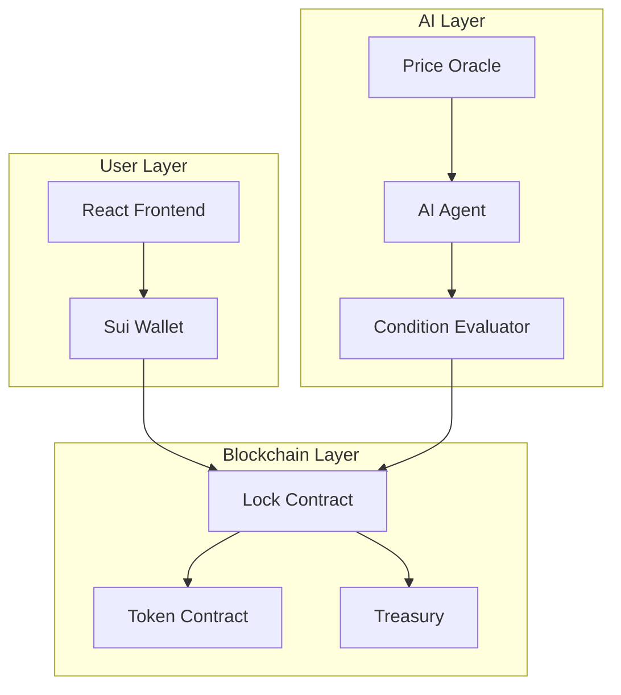

# LockUP 🔒
> Decentralized Asset Locking with AI-Powered Automation

[](https://opensource.org/licenses/MIT)
[](https://move-language.github.io/move/)
[](https://sui.io/)
[](https://www.typescriptlang.org/)

**LockUP** is a peer-to-peer decentralized asset locking protocol built on the Sui blockchain, featuring AI-powered automation for release conditions and intelligent contract management.

## Overview

LockUP enables users to lock digital assets (tokens, NFTs) on-chain with customizable release conditions. Our AI integration layer monitors off-chain events and automatically triggers contract releases based on predefined rules.

### Key Features

- 🔐 **Secure Asset Locking** - Non-custodial locking of SUI and custom tokens
- 🤖 **AI-Powered Release** - Automated unlocking based on ML model predictions
- ⚡ **Sub-Second Finality** - Leveraging Sui's parallel transaction execution
- 🎯 **Conditional Logic** - Time-based, event-based, or AI-evaluated conditions
- 🔄 **Cross-Contract Interoperability** - Compatible with any Move-based DeFi protocol

### Tech Stack

- **Blockchain:** Sui (Move language)
- **Frontend:** React 18 + TypeScript + Vite
- **AI/ML:** Python + PyTorch + LangChain
- **Smart Contracts:** Move
- **Infrastructure:** Sui Testnet/Mainnet

---

## Architecture



### System Components

1. **Lock Contract** - Core Move module managing asset custody and release logic
2. **AI Agent** - Off-chain service monitoring conditions and triggering releases
3. **Condition Evaluator** - ML model scoring release probability based on market data
4. **Treasury** - Escrow contract holding locked assets

---

## Smart Contract Architecture

### Core Modules

```move
module lockup::asset_lock {
    // Asset locking with time-based release
    public fun lock_asset<T>(asset: Coin<T>, release_time: u64)
    
    // AI-evaluated conditional release
    public fun lock_with_ai_condition<T>(
        asset: Coin<T>, 
        condition_hash: vector<u8>,
        min_confidence: u8
    )
    
    // Event-based release trigger
    public fun trigger_ai_release(lock_id: ID, ai_signature: vector<u8>)
}
```

### AI Integration Flow

```
User locks assets → AI agent monitors → Condition met → 
AI signs release → Contract verifies → Assets released
```

---

## Installation

### Prerequisites

- Node.js 18+
- Sui CLI (latest)
- Python 3.10+ (for AI components)
- Access to Sui Testnet

### Quick Start

```bash
# Clone the repository
git clone https://github.com/tricodenetwork/LockUP.git
cd LockUP

# Install dependencies
npm install

# Set up environment
cp .env.example .env

# Configure your environment variables
# VITE_SUI_NETWORK=testnet
# VITE_SUI_PACKAGE_ID=your_package_id
# VITE_AI_SERVICE_URL=your_ai_service_url

# Start development server
npm run dev
```

### Environment Variables

| Variable | Description | Required |
|----------|-------------|----------|
| `VITE_SUI_NETWORK` | Sui network (testnet/mainnet) | Yes |
| `VITE_SUI_PACKAGE_ID` | Deployed contract package ID | Yes |
| `VITE_AI_SERVICE_URL` | AI agent endpoint | Yes |
| `VITE_ADMIN_ADDRESS` | Admin wallet address | Yes |

---

## Usage

### Basic Lock (Time-based)

```typescript
import { lockAsset } from './services/lockup';

const result = await lockAsset({
  assetType: '0x2::sui::SUI',
  amount: 1000000000, // 1 SUI
  releaseTime: Date.now() + 86400000, // 24 hours
  recipient: '0x...'
});

console.log(`Assets locked. ID: ${result.lockId}`);
```

### AI-Conditional Lock

```typescript
import { lockWithAICondition } from './services/lockup';

const result = await lockWithAICondition({
  assetType: '0x2::sui::SUI',
  amount: 1000000000,
  condition: {
    type: 'price_threshold',
    targetPrice: 2.50,
    direction: 'above'
  },
  minConfidence: 85 // AI confidence threshold
});
```

### Monitor Lock Status

```typescript
import { getLockStatus } from './services/lockup';

const status = await getLockStatus(lockId);
console.log(`Lock ${lockId}: ${status.state}`);
// Output: Lock 0x...: locked | ai_evaluating | released
```

---

## AI Components

### Condition Evaluator

The AI layer evaluates complex release conditions using:

- **Price Prediction Models** - LSTM networks forecasting token prices
- **Sentiment Analysis** - NLP models analyzing market sentiment
- **Risk Scoring** - Classification models assessing unlock risk

### Example: Price-Based Release

```python
from lockup_ai import ConditionEvaluator

evaluator = ConditionEvaluator(model='price_lstm_v2')

condition = {
    'type': 'price_threshold',
    'token': 'SUI',
    'target': 2.50,
    'direction': 'above'
}

result = evaluator.evaluate(condition)
if result.confidence > 0.85:
    signature = evaluator.sign_release(lock_id)
    # Submit to blockchain
```

---

## Performance

- **Lock Transaction:** ~300ms (Sui finality)
- **AI Evaluation:** ~500ms average
- **Release Trigger:** ~200ms (contract execution)
- **Concurrent Locks:** 10,000+ per second (Sui TPS)

---

## Security Considerations

- ✅ **Non-custodial** - Users retain control of locked assets
- ✅ **Time-locked admin** - No instant admin withdrawal
- ✅ **AI oracle validation** - Multi-sig AI agent consensus
- ✅ **Formal verification** - Move prover verification on critical paths
- ✅ **Emergency pause** - Circuit breaker for contract upgrades

---

## Testing

```bash
# Run Move tests
sui move test

# Run integration tests
npm run test:integration

# Run AI model tests
python -m pytest ai/tests/
```

---

## Deployment

### Testnet

```bash
# Deploy contracts
sui client publish --gas-budget 100000000

# Update .env with package ID
# VITE_SUI_PACKAGE_ID=0x...
```

### Mainnet

```bash
# Verify contract security
sui move prove

# Deploy with multisig
sui client publish --gas-budget 100000000 --with-dry-run
```

---

## Contributing

Contributions are welcome! Please read our [Contributing Guide](CONTRIBUTING.md).

### Development Setup

```bash
# Install dev dependencies
npm install

# Run Sui local network
sui start

# Run AI service locally
python ai/app.py

# Run frontend
npm run dev
```

---

## License

MIT License - see [LICENSE](LICENSE)

---

## Related Projects

- [ThePoet](https://github.com/tricodenetwork/ThePoet) - Multi-agent AI orchestration
- [BritBye-RAG](https://github.com/tricodenetwork/BritBye-RAG) - Retrieval-Augmented Generation
- [MintJara](https://github.com/tricodenetwork/MintJara) - NFT marketplace with AI curation

---

## Contact

**Luke Okagha** - CEO & Software Architect
- LinkedIn: [linkedin.com/in/lukeokagha](https://linkedin.com/in/lukeokagha)
- Email: info@lukeokagha.com
- Website: [lukeokagha.com](https://lukeokagha.com)

Project Link: [https://github.com/tricodenetwork/LockUP](https://github.com/tricodenetwork/LockUP)

---

## Acknowledgments

- Sui Foundation for Move language and blockchain infrastructure
- Mysten Labs for Sui SDK and developer tools
- TRICODE PRO Limited for project sponsorship

---

*Built with 🌊 Move, ⚡ Sui, and 🤖 AI*
